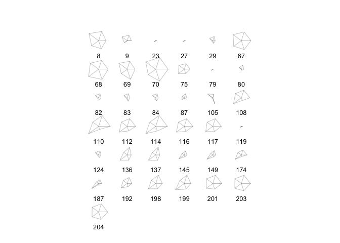

Homework 1
================
Phoebe Abramowitz
2/24/2018

Question 2
==========

``` r
imports85_column_types <- list(
  'real',
  'real',
  'character',
  'character',
  'character',
  'character',
  'character',
  'character',
  'character',
  'real',
  'real',
  'real',
  'real',
  'integer',
  'character',
  'character',
  'integer',
  'character',
  'real',
  'real',
  'real',
  'integer',
  'integer',
  'integer',
  'integer',
  'integer'
)
imports85_column_names <- c(
  'symboling',
  'normalized_losses',
  'make',
  'fuel_type',
  'aspiration',
  'num_of_doors',
  'body_style',
  'drive_wheels',
  'engine_location',
  'wheel_base',
  'length',
  'width',
  'height',
  'curb_weight',
  'engine_type',
  'num_of_cylinders',
  'engine_size',
  'fuel_system',
  'bore',
  'stroke',
  'compression_ratio',
  'horsepower',
  'peak_rpm',
  'city_mpg',
  'highway_mpg',
  'price'
)

imports85 <- read.csv('imports-85.data', col.names=imports85_column_names,
         colClasses = imports85_column_types, na.strings=c("?","NA"))
str(imports85)
```

    ## 'data.frame':    204 obs. of  26 variables:
    ##  $ symboling        : num  3 1 2 2 2 1 1 1 0 2 ...
    ##  $ normalized_losses: num  NA NA 164 164 NA 158 NA 158 NA 192 ...
    ##  $ make             : chr  "alfa-romero" "alfa-romero" "audi" "audi" ...
    ##  $ fuel_type        : chr  "gas" "gas" "gas" "gas" ...
    ##  $ aspiration       : chr  "std" "std" "std" "std" ...
    ##  $ num_of_doors     : chr  "two" "two" "four" "four" ...
    ##  $ body_style       : chr  "convertible" "hatchback" "sedan" "sedan" ...
    ##  $ drive_wheels     : chr  "rwd" "rwd" "fwd" "4wd" ...
    ##  $ engine_location  : chr  "front" "front" "front" "front" ...
    ##  $ wheel_base       : num  88.6 94.5 99.8 99.4 99.8 ...
    ##  $ length           : num  169 171 177 177 177 ...
    ##  $ width            : num  64.1 65.5 66.2 66.4 66.3 71.4 71.4 71.4 67.9 64.8 ...
    ##  $ height           : num  48.8 52.4 54.3 54.3 53.1 55.7 55.7 55.9 52 54.3 ...
    ##  $ curb_weight      : int  2548 2823 2337 2824 2507 2844 2954 3086 3053 2395 ...
    ##  $ engine_type      : chr  "dohc" "ohcv" "ohc" "ohc" ...
    ##  $ num_of_cylinders : chr  "four" "six" "four" "five" ...
    ##  $ engine_size      : int  130 152 109 136 136 136 136 131 131 108 ...
    ##  $ fuel_system      : chr  "mpfi" "mpfi" "mpfi" "mpfi" ...
    ##  $ bore             : num  3.47 2.68 3.19 3.19 3.19 3.19 3.19 3.13 3.13 3.5 ...
    ##  $ stroke           : num  2.68 3.47 3.4 3.4 3.4 3.4 3.4 3.4 3.4 2.8 ...
    ##  $ compression_ratio: num  9 9 10 8 8.5 8.5 8.5 8.3 7 8.8 ...
    ##  $ horsepower       : int  111 154 102 115 110 110 110 140 160 101 ...
    ##  $ peak_rpm         : int  5000 5000 5500 5500 5500 5500 5500 5500 5500 5800 ...
    ##  $ city_mpg         : int  21 19 24 18 19 19 19 17 16 23 ...
    ##  $ highway_mpg      : int  27 26 30 22 25 25 25 20 22 29 ...
    ##  $ price            : int  16500 16500 13950 17450 15250 17710 18920 23875 NA 16430 ...

``` r
library(readr)
imports85_2 <- read_csv('imports-85.data', col_names = imports85_column_names, na="?",
                        col_types = list(
                          'symboling' <- col_double(),
                          'normalized_losses' <- col_double(),
                          'make' <- col_character(),
                          'fuel_type' <- col_character(),
                          'aspiration'<- col_character(),
                          'num_of_doors'<- col_character(),
                          'body_style'<- col_character(),
                          'drive_wheels'<- col_character(),
                          'engine_location'<- col_character(),
                          'wheel_base'<- col_double(),
                          'length'<- col_double(),
                          'width'<- col_double(),
                              'height'<- col_double(),
                              'curb_weight' <- col_integer(),
                              'engine_type'<- col_character(),
                              'num_of_cylinders'<- col_character(),
                              'engine_size'<- col_integer(),
                              'fuel_system'<- col_character(),
                              'bore'<- col_double(),
                              'stroke'<- col_double(),
                              'compression_ratio'<- col_double(),
                              'horsepower'<- col_integer(),
                              'peak_rpm'<- col_integer(),
                              'city_mpg'<- col_integer(),
                              'highway_mpg'<- col_integer(),
                              'price'<- col_integer()
                             ))
                               
str(imports85_2)
```

    ## Classes 'tbl_df', 'tbl' and 'data.frame':    205 obs. of  26 variables:
    ##  $ symboling        : num  3 3 1 2 2 2 1 1 1 0 ...
    ##  $ normalized_losses: num  NA NA NA 164 164 NA 158 NA 158 NA ...
    ##  $ make             : chr  "alfa-romero" "alfa-romero" "alfa-romero" "audi" ...
    ##  $ fuel_type        : chr  "gas" "gas" "gas" "gas" ...
    ##  $ aspiration       : chr  "std" "std" "std" "std" ...
    ##  $ num_of_doors     : chr  "two" "two" "two" "four" ...
    ##  $ body_style       : chr  "convertible" "convertible" "hatchback" "sedan" ...
    ##  $ drive_wheels     : chr  "rwd" "rwd" "rwd" "fwd" ...
    ##  $ engine_location  : chr  "front" "front" "front" "front" ...
    ##  $ wheel_base       : num  88.6 88.6 94.5 99.8 99.4 ...
    ##  $ length           : num  169 169 171 177 177 ...
    ##  $ width            : num  64.1 64.1 65.5 66.2 66.4 66.3 71.4 71.4 71.4 67.9 ...
    ##  $ height           : num  48.8 48.8 52.4 54.3 54.3 53.1 55.7 55.7 55.9 52 ...
    ##  $ curb_weight      : int  2548 2548 2823 2337 2824 2507 2844 2954 3086 3053 ...
    ##  $ engine_type      : chr  "dohc" "dohc" "ohcv" "ohc" ...
    ##  $ num_of_cylinders : chr  "four" "four" "six" "four" ...
    ##  $ engine_size      : int  130 130 152 109 136 136 136 136 131 131 ...
    ##  $ fuel_system      : chr  "mpfi" "mpfi" "mpfi" "mpfi" ...
    ##  $ bore             : num  3.47 3.47 2.68 3.19 3.19 3.19 3.19 3.19 3.13 3.13 ...
    ##  $ stroke           : num  2.68 2.68 3.47 3.4 3.4 3.4 3.4 3.4 3.4 3.4 ...
    ##  $ compression_ratio: num  9 9 9 10 8 8.5 8.5 8.5 8.3 7 ...
    ##  $ horsepower       : int  111 111 154 102 115 110 110 110 140 160 ...
    ##  $ peak_rpm         : int  5000 5000 5000 5500 5500 5500 5500 5500 5500 5500 ...
    ##  $ city_mpg         : int  21 21 19 24 18 19 19 19 17 16 ...
    ##  $ highway_mpg      : int  27 27 26 30 22 25 25 25 20 22 ...
    ##  $ price            : int  13495 16500 16500 13950 17450 15250 17710 18920 23875 NA ...
    ##  - attr(*, "spec")=List of 2
    ##   ..$ cols   :List of 26
    ##   .. ..$ symboling        : list()
    ##   .. .. ..- attr(*, "class")= chr  "collector_double" "collector"
    ##   .. ..$ normalized_losses: list()
    ##   .. .. ..- attr(*, "class")= chr  "collector_double" "collector"
    ##   .. ..$ make             : list()
    ##   .. .. ..- attr(*, "class")= chr  "collector_character" "collector"
    ##   .. ..$ fuel_type        : list()
    ##   .. .. ..- attr(*, "class")= chr  "collector_character" "collector"
    ##   .. ..$ aspiration       : list()
    ##   .. .. ..- attr(*, "class")= chr  "collector_character" "collector"
    ##   .. ..$ num_of_doors     : list()
    ##   .. .. ..- attr(*, "class")= chr  "collector_character" "collector"
    ##   .. ..$ body_style       : list()
    ##   .. .. ..- attr(*, "class")= chr  "collector_character" "collector"
    ##   .. ..$ drive_wheels     : list()
    ##   .. .. ..- attr(*, "class")= chr  "collector_character" "collector"
    ##   .. ..$ engine_location  : list()
    ##   .. .. ..- attr(*, "class")= chr  "collector_character" "collector"
    ##   .. ..$ wheel_base       : list()
    ##   .. .. ..- attr(*, "class")= chr  "collector_double" "collector"
    ##   .. ..$ length           : list()
    ##   .. .. ..- attr(*, "class")= chr  "collector_double" "collector"
    ##   .. ..$ width            : list()
    ##   .. .. ..- attr(*, "class")= chr  "collector_double" "collector"
    ##   .. ..$ height           : list()
    ##   .. .. ..- attr(*, "class")= chr  "collector_double" "collector"
    ##   .. ..$ curb_weight      : list()
    ##   .. .. ..- attr(*, "class")= chr  "collector_integer" "collector"
    ##   .. ..$ engine_type      : list()
    ##   .. .. ..- attr(*, "class")= chr  "collector_character" "collector"
    ##   .. ..$ num_of_cylinders : list()
    ##   .. .. ..- attr(*, "class")= chr  "collector_character" "collector"
    ##   .. ..$ engine_size      : list()
    ##   .. .. ..- attr(*, "class")= chr  "collector_integer" "collector"
    ##   .. ..$ fuel_system      : list()
    ##   .. .. ..- attr(*, "class")= chr  "collector_character" "collector"
    ##   .. ..$ bore             : list()
    ##   .. .. ..- attr(*, "class")= chr  "collector_double" "collector"
    ##   .. ..$ stroke           : list()
    ##   .. .. ..- attr(*, "class")= chr  "collector_double" "collector"
    ##   .. ..$ compression_ratio: list()
    ##   .. .. ..- attr(*, "class")= chr  "collector_double" "collector"
    ##   .. ..$ horsepower       : list()
    ##   .. .. ..- attr(*, "class")= chr  "collector_integer" "collector"
    ##   .. ..$ peak_rpm         : list()
    ##   .. .. ..- attr(*, "class")= chr  "collector_integer" "collector"
    ##   .. ..$ city_mpg         : list()
    ##   .. .. ..- attr(*, "class")= chr  "collector_integer" "collector"
    ##   .. ..$ highway_mpg      : list()
    ##   .. .. ..- attr(*, "class")= chr  "collector_integer" "collector"
    ##   .. ..$ price            : list()
    ##   .. .. ..- attr(*, "class")= chr  "collector_integer" "collector"
    ##   ..$ default: list()
    ##   .. ..- attr(*, "class")= chr  "collector_guess" "collector"
    ##   ..- attr(*, "class")= chr "col_spec"

Question 3
==========

a)If you don't provide a vector of column names when invoking read.csv('imports-85.data'), the entries of the first row of data become the column names.
b)If you don't provide a vector of column names when invoking read.csv('imports-85.data',header=FALSE), then the column names of the imported data are "V1","V2",...,"V26"
c)If you don't specify how missing values are codified, then the data type of any column that contains "?" will be Factor.
d) The second object is bigger becuase characters take twice as many bits as integers and we specified many types as characters.
e)If you do it as an R matrix, all the ones of the type character become NA becuase they're data types that can't be transformed into integers.

Question 4
==========

``` r
hist(imports85$price, col="blue",sub='Histogram showing how many times each price level occurs' )
```


``` r
boxplot(imports85$horsepower,horizontal = TRUE, sub='Summarizes the distribution of Horsepower' )
```


``` r
bs_frequency <- table(imports85$body_style)
barplot(sort(bs_frequency,decreasing = TRUE),sub="Shows number of cars with each Body Style")
```


``` r
stars(imports85[imports85$aspiration=='turbo',c('wheel_base','length','width',
                                                  'height','price')])
```

 The Stars plot displays the five variables(wheel\_base, length, width, height, and price) for each car that has turbo aspiration.

Question 5
==========

``` r
gas_cars <- imports85[imports85$fuel_type=='gas',]
diesel_cars <- imports85[imports85$fuel_type=='diesel',]
#Mean Price of Gas Type Cars is:
mean(gas_cars[,'price'],na.rm=TRUE)
```

    ## [1] 12913.19

``` r
#Mean Price of Diesel Type Cars is
mean(diesel_cars[,'price'],na.rm=TRUE)
```

    ## [1] 15838.15

``` r
#The Make of the Car with 12 cylinders is:
imports85[imports85$num_of_cylinders=='twelve',"make"]
```

    ## [1] "jaguar"

``` r
#The make that has the most diesel cars + number of diesel cars is
diesel <- imports85[imports85$fuel_type=='diesel',]
pivot_diesel_by_make <- (table(diesel$make))
sort(pivot_diesel_by_make,decreasing=TRUE)[1]
```

    ## peugot 
    ##      5

``` r
#Price of the Car with the Most horsepower
imports85$horsepower
```

    ##   [1] 111 154 102 115 110 110 110 140 160 101 101 121 121 121 182 182 182
    ##  [18]  48  70  70  68  68 102  68  68  68 102  88 145  58  76  60  76  76
    ##  [35]  76  76  86  86  86  86 101 100  78  70  70  90 176 176 262  68  68
    ##  [52]  68  68  68 101 101 101 135  84  84  84  84  64  84 120  72 123 123
    ##  [69] 123 123 155 155 184 184 175  68  68  68 102 116  88 145 145 145  88
    ##  [86]  88 116 116  69  55  69  69  69  69  69  69  69  69  97  97 152 152
    ## [103] 152 160 200 160  97  95  97  95  95  95  95  95  97  95 142  68 102
    ## [120]  68  68  68  88 145 143 207 207 207 288  NA  NA 110 110 110 110 160
    ## [137] 160  69  73  73  82  82  94  82 111  82  94  82 111  62  62  62  62
    ## [154]  62  62  70  70  56  56  70  70  70  70  70 112 112 116 116 116 116
    ## [171] 116 116  92  73  92  92  92 161 161 156 156  52  85  52  85  85  68
    ## [188] 100  90  90 110  68  88 114 114 114 114 162 162 114 160 134 106 114

``` r
max(imports85$horsepower, na.rm=TRUE)
```

    ## [1] 288

``` r
imports85$horsepower==max(imports85$horsepower, na.rm=TRUE)
```

    ##   [1] FALSE FALSE FALSE FALSE FALSE FALSE FALSE FALSE FALSE FALSE FALSE
    ##  [12] FALSE FALSE FALSE FALSE FALSE FALSE FALSE FALSE FALSE FALSE FALSE
    ##  [23] FALSE FALSE FALSE FALSE FALSE FALSE FALSE FALSE FALSE FALSE FALSE
    ##  [34] FALSE FALSE FALSE FALSE FALSE FALSE FALSE FALSE FALSE FALSE FALSE
    ##  [45] FALSE FALSE FALSE FALSE FALSE FALSE FALSE FALSE FALSE FALSE FALSE
    ##  [56] FALSE FALSE FALSE FALSE FALSE FALSE FALSE FALSE FALSE FALSE FALSE
    ##  [67] FALSE FALSE FALSE FALSE FALSE FALSE FALSE FALSE FALSE FALSE FALSE
    ##  [78] FALSE FALSE FALSE FALSE FALSE FALSE FALSE FALSE FALSE FALSE FALSE
    ##  [89] FALSE FALSE FALSE FALSE FALSE FALSE FALSE FALSE FALSE FALSE FALSE
    ## [100] FALSE FALSE FALSE FALSE FALSE FALSE FALSE FALSE FALSE FALSE FALSE
    ## [111] FALSE FALSE FALSE FALSE FALSE FALSE FALSE FALSE FALSE FALSE FALSE
    ## [122] FALSE FALSE FALSE FALSE FALSE FALSE FALSE  TRUE    NA    NA FALSE
    ## [133] FALSE FALSE FALSE FALSE FALSE FALSE FALSE FALSE FALSE FALSE FALSE
    ## [144] FALSE FALSE FALSE FALSE FALSE FALSE FALSE FALSE FALSE FALSE FALSE
    ## [155] FALSE FALSE FALSE FALSE FALSE FALSE FALSE FALSE FALSE FALSE FALSE
    ## [166] FALSE FALSE FALSE FALSE FALSE FALSE FALSE FALSE FALSE FALSE FALSE
    ## [177] FALSE FALSE FALSE FALSE FALSE FALSE FALSE FALSE FALSE FALSE FALSE
    ## [188] FALSE FALSE FALSE FALSE FALSE FALSE FALSE FALSE FALSE FALSE FALSE
    ## [199] FALSE FALSE FALSE FALSE FALSE FALSE

``` r
imports85[which.max(imports85$horsepower),'price' ]
```

    ## [1] NA

``` r
imports85[,"price"][which.max(imports85$horsepower)]
```

    ## [1] NA

``` r
#Bottom 10th percentile
bottom_city_mpg <- quantile(imports85$city_mpg,0.1)
#Top 10th percentile
top_highway_mpg <- quantile(imports85$highway_mpg,0.9)
#median in bottom
median(imports85[imports85$city_mpg<=bottom_city_mpg,'price'],na.rm=TRUE)
```

    ## [1] 32250

Question 6
==========

1.  "NULL" is returned
2.  mtcars\[, mpg\] fails to return the vector
3.  This is becuase putting mpg as the second index indicates that we're trying to retrieve the row by it's name, which should be a character in quotes to indicate that its a row name.
4.  YES you can include and R list of the proper length as the column of a data frame because the data frame itself is a list.
    e)When you apply as.list() to a data frame, under the heading of the name of the first column, every value from that first column is listed in the same order as the data frame, and similar lists are produced for the values of every column in the data frame.
5.  You could use data.frame and input abc\[i\] as an argument to get desired ith column in the new dataframe.

Question 7
==========

``` r
qdat <-  na.omit(imports85[,c(
  'wheel_base',
  'length',
  'width',
  'height',
  'curb_weight',
  'engine_size',
  'bore',
  'stroke',
  'compression_ratio',
  'horsepower',
  'peak_rpm',
  'city_mpg',
  'highway_mpg',
  'price')])
library(corrplot)
```

    ## corrplot 0.84 loaded

``` r
cor_qdat <-  cor(qdat)

#Corellelograms
corrplot(cor_qdat,method='circle')
```


``` r
corrplot(cor_qdat,method='color',order="hclust")
```

 These two correlograms let us observe that city mpg and highway mpg are more positively correlated with each other than any two variables. It also shows us that wheelbase,length,width,curb weight,bore,horsepower,engine size,and price are all fairly positively correlated with each other. Comparatively, those variables are all negatively correlated with mpg(both city and highway). Stroke is entirely or almost entirely uncorrelated with many variables.

Question 8.1
============

``` r
imports85_pca_prcomp <- prcomp(qdat,scale.=TRUE)
imports85_pca_prcomp
```

    ## Standard deviations (1, .., p=14):
    ##  [1] 2.7475837 1.5060881 1.1104814 0.9415972 0.7816626 0.6453100 0.5683069
    ##  [8] 0.5152131 0.3474131 0.3328790 0.2841045 0.2522710 0.2264319 0.1404923
    ## 
    ## Rotation (n x k) = (14 x 14):
    ##                           PC1         PC2         PC3         PC4
    ## wheel_base         0.28960537 -0.28776469  0.12825722 -0.23652135
    ## length             0.32825371 -0.16291817  0.12443745 -0.15341037
    ## width              0.32385577 -0.12228603 -0.05224038 -0.09116177
    ## height             0.11165134 -0.39825905  0.47877659 -0.38891269
    ## curb_weight        0.35152561 -0.06225292 -0.05555184  0.00962865
    ## engine_size        0.32148857  0.08138399 -0.24801695  0.18681666
    ## bore               0.25933812 -0.00152011  0.15996983  0.39947230
    ## stroke             0.05207944 -0.10140422 -0.70418366 -0.48551771
    ## compression_ratio  0.01457865 -0.52209295 -0.28742497  0.15076971
    ## horsepower         0.29746310  0.30329643 -0.13678214  0.09496034
    ## peak_rpm          -0.08134054  0.45265347  0.06885913 -0.51906416
    ## city_mpg          -0.30933538 -0.27073757 -0.11494937  0.09076060
    ## highway_mpg       -0.31930591 -0.22045403 -0.11542402  0.09394433
    ## price              0.31808522  0.07026628 -0.13208265  0.11144967
    ##                            PC5          PC6          PC7         PC8
    ## wheel_base         0.039823148 -0.094851281  0.312791581 -0.28123376
    ## length             0.008747757 -0.003515893  0.225237742 -0.01689368
    ## width             -0.130898609 -0.126294675  0.465989060 -0.16466049
    ## height             0.004869753  0.086377731 -0.604835396 -0.01364638
    ## curb_weight       -0.057552930 -0.044574905  0.003667024  0.13267017
    ## engine_size       -0.087151685 -0.175013044 -0.257485782 -0.25189551
    ## bore               0.320745737  0.761356525  0.048055342 -0.21690921
    ## stroke             0.428739000  0.193110176 -0.139062703 -0.03536755
    ## compression_ratio -0.497584170  0.319335342  0.041394069  0.48025723
    ## horsepower        -0.132731142  0.066034856 -0.239087112  0.05356797
    ## peak_rpm          -0.488766446  0.441801245  0.129137113 -0.12743928
    ## city_mpg          -0.156781350  0.032403884 -0.001816202 -0.45800063
    ## highway_mpg       -0.142181473  0.061921052 -0.035248376 -0.47139543
    ## price             -0.366988494 -0.107700500 -0.322023824 -0.28676496
    ##                           PC9        PC10         PC11        PC12
    ## wheel_base         0.33133704 -0.40670774  0.323414463 -0.41475361
    ## length             0.43201694  0.30321158 -0.639526649  0.20251002
    ## width             -0.66937391  0.34869062  0.117355593  0.06323667
    ## height            -0.18092287  0.15963483  0.108932518  0.05564054
    ## curb_weight        0.18111238  0.06302285  0.178024108  0.19371022
    ## engine_size        0.21100607 -0.01333982  0.340898924  0.56334113
    ## bore              -0.09432189 -0.07139872  0.005714896  0.03892634
    ## stroke            -0.07401280 -0.02238834 -0.078517768 -0.02658853
    ## compression_ratio  0.03629040 -0.07698872  0.053373838 -0.01814615
    ## horsepower         0.17729357  0.53456772  0.166529419 -0.59094530
    ## peak_rpm           0.07470289 -0.06299820  0.086907351  0.17191680
    ## city_mpg           0.09507528  0.14319387  0.153654290  0.02105384
    ## highway_mpg        0.11825627  0.28788771 -0.156930608 -0.08238237
    ## price             -0.26406147 -0.43219415 -0.469358290 -0.19090356
    ##                           PC13         PC14
    ## wheel_base         0.114513668  0.092130534
    ## length             0.140734004 -0.164908534
    ## width              0.061960310  0.022879981
    ## height             0.040229847  0.012236338
    ## curb_weight       -0.853568596  0.109052120
    ## engine_size        0.373520444  0.088596156
    ## bore              -0.009873853 -0.005714601
    ## stroke            -0.018543375 -0.022580685
    ## compression_ratio  0.169093835  0.030351581
    ## horsepower         0.089734610 -0.087140503
    ## peak_rpm          -0.015222161  0.020783432
    ## city_mpg          -0.183051668 -0.697896165
    ## highway_mpg       -0.093991369  0.665339990
    ## price             -0.117753083 -0.068386662

``` r
eigs <- imports85_pca_prcomp$sdev^2
eigs_perc <- 100 * eigs / sum(eigs)
eigs_cum <- cumsum(eigs_perc)

eigs_df <- data.frame(
  eigenvalue = eigs,
  percentage = eigs_perc,
  'cumulative percentage' = eigs_cum
)
print(round(eigs_df, 4), print.gap = 2)
```

    ##     eigenvalue  percentage  cumulative.percentage
    ## 1       7.5492     53.9230                53.9230
    ## 2       2.2683     16.2022                70.1251
    ## 3       1.2332      8.8083                78.9335
    ## 4       0.8866      6.3329                85.2664
    ## 5       0.6110      4.3643                89.6306
    ## 6       0.4164      2.9745                92.6051
    ## 7       0.3230      2.3069                94.9120
    ## 8       0.2654      1.8960                96.8081
    ## 9       0.1207      0.8621                97.6702
    ## 10      0.1108      0.7915                98.4617
    ## 11      0.0807      0.5765                99.0382
    ## 12      0.0636      0.4546                99.4928
    ## 13      0.0513      0.3662                99.8590
    ## 14      0.0197      0.1410               100.0000

``` r
barplot(eigs, las = 1, names.arg = paste('PC', 1:ncol(qdat)), 
        main = 'Bar-chart of eigenvalues')
```

 53.9% of the variation in the data is captured by the first PC, 16.2% is captured by the second PC, and 8.8% of the variation is captured by the third PC. ~89% of the variation in data is captured by the first 3 PC. \#\#Question 8.2

``` r
imports85_pca_prcomp$x
```

    ##             PC1          PC2           PC3          PC4          PC5
    ## 1   -0.50476677  2.164293389  0.2438622707  2.501155552 -0.331836703
    ## 2    0.43364216  1.389555477 -1.4251059077 -0.623850673 -0.372504088
    ## 3   -0.18005267  0.279943412 -0.0539888750 -1.137373495 -0.275920298
    ## 4    1.26114560  1.184570340 -0.0002441805 -1.188130667 -0.047776041
    ## 5    0.70279657  1.138947855 -0.2407026202 -0.986248012 -0.036792292
    ## 6    2.61007291 -0.091333360  0.3621365355 -2.011237281 -0.442988601
    ## 7    2.73122653 -0.093823973  0.3307341666 -1.992528222 -0.509999513
    ## 8    3.49236750  0.401572042  0.2969499481 -2.094315925 -0.736944460
    ## 10   0.03375430  1.007052562  1.6733895897 -0.122389928 -0.873531115
    ## 11   0.05324782  1.011358758  1.6652950423 -0.115559851 -0.896021622
    ## 12   1.30975741 -0.250399043 -0.0204450231  1.042026318  0.669227800
    ## 13   1.35182522 -0.255733061 -0.0284604756  1.044895725  0.657076967
    ## 14   2.68408728 -0.743560175  0.3534606635  0.484800629  0.452558902
    ## 15   4.32992645  1.301180112 -0.1621582930 -0.334377024 -0.431049844
    ## 16   5.02957834  1.590771628 -0.7304752883  0.039891486 -0.989108930
    ## 17   6.05000328  0.688009235 -0.0003359943 -0.905713628 -0.869279071
    ## 18  -6.75271621 -0.611353113 -0.1633689323  0.914281363 -0.634098147
    ## 19  -3.95349413  0.069301295 -0.2653255137  0.218925403 -0.666242823
    ## 20  -3.84294075  0.029806004 -0.2447364895  0.187845459 -0.680764694
    ## 21  -3.93708548  0.444870230 -0.7223103640 -0.028064739 -0.566338804
    ## 22  -3.47585977  0.803240012 -0.5765599328 -0.143475914 -0.392595237
    ## 23  -2.12837968  1.806411636 -0.7373307418 -0.432463993  0.220189323
    ## 24  -3.43028328  0.824720841 -0.6240662032 -0.111102680 -0.396236375
    ## 25  -3.39734939  0.826145283 -0.6339606062 -0.104311481 -0.419679774
    ## 26  -3.36123715  0.834122619 -0.6489559598 -0.091658591 -0.461344006
    ## 27  -2.07201674  1.837721690 -0.7941284024 -0.390268438  0.185580325
    ## 28   0.10854230 -1.153289735  1.1670191047 -1.499059758  1.046372329
    ## 29   1.41759314  1.703245832 -2.0257759213  0.148983197  1.729296814
    ## 30  -5.81930884 -0.792587488 -1.9657193994  1.153748674 -0.301837146
    ## 31  -4.18660694  1.826172530 -1.2509283954 -0.610362884 -0.821233775
    ## 32  -4.37073968  0.033715189 -0.0934545850 -0.100115816 -0.936771461
    ## 33  -3.30514861  1.267436460 -0.6095905901 -1.322179649 -0.664405468
    ## 34  -3.27082879  1.270762728 -0.6210917187 -1.313607923 -0.693417105
    ## 35  -2.65420052  0.640576357 -0.0542811250 -1.894391610 -0.675324629
    ## 36  -2.63726804  0.089488165  0.6558826709 -2.420140619 -0.655563498
    ## 37  -1.54631576  0.748412339 -0.6489349209 -1.435919085 -0.030340299
    ## 38  -1.46364376  0.752579838 -0.6741547204 -1.418391271 -0.090660996
    ## 39  -1.21844338  0.511539104 -0.4317534933 -1.649501227 -0.073775404
    ## 40  -1.52563345  0.670818209 -0.3965528026 -1.512914823  0.018512141
    ## 41  -0.45373362  0.935816717 -0.4316907447 -1.663597327 -0.152830484
    ## 42  -1.00456137  1.040628685 -1.1942222343 -0.763591758  0.141113688
    ## 43  -1.50751607  0.356399965  0.3838004015  0.462315942  1.198357780
    ## 46  -0.28852095  0.612871812 -0.2203513182  0.684599613  0.549593797
    ## 47   6.72283550  0.254700921 -2.6784426464 -0.763043645  1.060031245
    ## 48   6.85279230  0.283408893 -2.7324062961 -0.717509802  0.910094533
    ## 49   7.01823705  2.936540244 -1.7920972676  2.961044881 -2.317359851
    ## 50  -2.76673835  0.084423260  0.4026592230 -0.071149907  0.337272629
    ## 51  -3.09957998 -0.176731857  0.2508532461  0.051732859  0.125350404
    ## 52  -3.06867235 -0.171233963  0.2388784250  0.061483068  0.092998642
    ## 53  -2.84371867 -0.277174646  0.3129277957 -0.033646345  0.098553666
    ## 54  -2.76520513 -0.271955794  0.3303181527  0.049433786  0.125080230
    ## 59  -0.27290037 -0.415805340 -0.0591540369  0.002797809  0.992342832
    ## 60  -0.18536046 -0.723640056  0.3067834272 -0.296322121  1.009200860
    ## 61  -0.20398388 -0.400581415 -0.0877711238  0.026944544  0.912830940
    ## 62  -0.11644397 -0.708416132  0.2781663403 -0.272175386  0.929688967
    ## 63  -1.10226433 -3.564518899 -1.0276241235  0.652861247 -1.048309146
    ## 64  -0.06704001 -0.701491774  0.2602297605 -0.258102708  0.882612584
    ## 65   1.74691971  0.409007057  0.7881307704  0.498765447  0.692742354
    ## 66   0.16240458 -3.603339797 -1.8069692267  0.860441609 -0.283322910
    ## 67   4.36799367 -3.134935942 -1.3582652905  0.122650074 -0.597357752
    ## 68   4.73461517 -3.508196396 -0.9836791152 -0.196096722 -0.741049928
    ## 69   4.13688287 -2.641538856 -1.8247924767  0.590102629 -0.741585310
    ## 70   5.55253988 -3.575696983 -1.3245409944 -0.176881500 -0.941600844
    ## 71   6.58443703 -0.494336093  0.6204887834 -0.313556889 -0.668150068
    ## 72   4.64484923  1.730806268 -1.1288817322  1.692089938 -0.779420747
    ## 73   8.76095319 -0.569549926 -0.1571119002  0.201988029 -0.080217071
    ## 74   8.10962983  0.219562828 -0.7313291976  0.896070119 -0.338688179
    ## 75   2.71265018  0.797586751  0.7679867054  0.563433556  0.458206433
    ## 76  -3.80973389  0.409128277 -0.7496751257 -0.046826896 -0.602394674
    ## 77  -3.33129589  0.763095601 -0.6072943679 -0.161460900 -0.432490412
    ## 78  -3.27230065  0.760171196 -0.6214794609 -0.153739623 -0.460863452
    ## 79  -2.16079220  1.835075344 -0.7494545987 -0.408721555  0.225938436
    ## 80  -0.77982215  1.777986485 -1.0788539066 -0.365322890  0.253231137
    ## 81  -0.92016691  0.809788627 -1.1291331825  0.507357750  0.916754416
    ## 82   1.39338673  1.710830900 -1.9441524780  0.177632264  1.663632807
    ## 83   1.54992325  1.719848220 -1.9842018715  0.224816723  1.564005955
    ## 84   1.53829956  1.715950777 -1.9785158618  0.219664946  1.580724389
    ## 85  -0.86723928  0.431187417 -0.6708314197  0.134314242  0.985405000
    ## 86  -0.79325398  0.436893273 -0.6946784550  0.151604118  0.926506516
    ## 87  -0.69688125  1.407079105 -0.6337024302 -0.726987159  0.284607970
    ## 88  -0.69688125  1.407079105 -0.6337024302 -0.726987159  0.284607970
    ## 89  -2.73775503 -0.224180907  0.1765902321 -0.367733920  0.273590130
    ## 90  -3.94306913 -3.381789082 -1.7598469152  0.415980845 -1.441667331
    ## 91  -2.67308904 -0.217608334  0.1547223976 -0.351335282  0.218166827
    ## 92  -2.65184873 -0.218235161  0.1493399284 -0.348209598  0.206891732
    ## 93  -2.49305302 -0.120229131 -0.0207336534 -0.236112236  0.176143609
    ## 94  -2.62544065 -0.215858794  0.1406084847 -0.341762500  0.185023603
    ## 95  -2.60283380 -0.023309122 -0.1146155699 -0.140636447  0.151631489
    ## 96  -2.60420034 -0.216485621  0.1352260155 -0.338636815  0.173748508
    ## 97  -2.45876878 -0.116112887 -0.0327356213 -0.226905511  0.145188406
    ## 98  -2.65402001 -0.003620640 -0.1391022570 -0.118781807  0.135049834
    ## 99  -0.81995268 -0.001956645 -0.1349305388 -0.582351671  0.590222172
    ## 100 -0.81102473  0.005866360 -0.1424189720 -0.574475454  0.565367775
    ## 101  2.46959040  0.914014808  0.2018505537 -0.270642474  0.202636564
    ## 102  2.76249231  0.692585301  0.3963573529 -0.453878270  0.143834564
    ## 103  2.28581041  0.699224988  0.1479310433 -0.237354040  0.097230481
    ## 104  1.66337432  2.229515222 -1.3949834334  1.181589945 -0.266103119
    ## 105  2.30624655  2.865570339 -1.4328482314  1.217168305 -0.289853710
    ## 106  2.33574690  1.757761484 -1.1781274253  0.797511272 -0.271057045
    ## 107  2.16206240 -0.684916718  1.4231484427 -0.978050982  0.659498725
    ## 108  2.18509372 -3.861744653 -0.7313281241  0.678313986  0.194749230
    ## 109  3.03694427 -1.496475448  2.0491409861 -1.688115339  0.665735964
    ## 110  3.59822318 -4.290485111  0.0790421413 -0.182004507  0.432653379
    ## 111  2.16126406 -0.350611710  3.6197320552  0.623748804 -0.879895473
    ## 112  2.36755426 -3.836065361 -0.7976406709  0.730373741  0.020621312
    ## 113  2.96476989 -0.821799902  3.8331507549  0.249116324 -0.903884321
    ## 114  3.76158401 -4.269025021  0.0206606157 -0.136636846  0.280561614
    ## 115  2.38508521 -0.650277059  1.3399926962 -0.911779149  0.438572378
    ## 116  2.40890416 -3.826931006 -0.8148109231  0.744861782 -0.027085823
    ## 117  2.98473507  0.654747147  1.1748083698 -1.139809648 -0.042932840
    ## 118 -3.90905658  0.441182399 -0.7260395405 -0.027666305 -0.569711596
    ## 119 -2.12837968  1.806411636 -0.7373307418 -0.432463993  0.220189323
    ## 120 -3.43028328  0.824720841 -0.6240662032 -0.111102680 -0.396236375
    ## 121 -3.12539743  0.662300212 -0.4941136293 -0.259764801 -0.412272906
    ## 122 -2.89239459  0.662046895 -0.5782031052 -0.207437296 -0.492819957
    ## 123  0.11806348 -1.153345543  1.1728921403 -1.484393773  1.058147994
    ## 124  1.39820122  1.713724536 -1.9389030875  0.193886453  1.670915713
    ## 125  1.79614455  2.087163617 -0.4267951363  1.575413363 -0.368687821
    ## 126  2.25244702  3.570786684 -0.3412898209  1.714148053 -1.835002582
    ## 127  2.31151830  3.583835762 -0.3658187526  1.734845255 -1.903155633
    ## 128  2.45906196  3.604727171 -0.4195228948  1.777044984 -2.044275382
    ## 132  1.02393273  0.038574674  1.3357167177 -0.282224693  0.137512556
    ## 133  1.06122246  0.038262323  1.3272826888 -0.277502370  0.120147452
    ## 134  0.06334539  0.392168351  2.9471430863 -0.149261860 -2.562298929
    ## 135  1.23485155  0.059863154  1.2660123076 -0.230263520 -0.038498942
    ## 136  1.90946763  0.904821877  1.1648691945 -0.411177938 -0.471887708
    ## 137  1.95403671  0.904295516  1.1530651699 -0.403979002 -0.497508972
    ## 138 -2.61239728  0.151355562  2.2885465977  2.350763915 -0.056482028
    ## 139 -1.70942703  0.026614300  1.6648339241  2.384306962  0.967262374
    ## 140 -1.51794696 -0.302950236  2.0270654552  2.080915640  0.917948329
    ## 141 -1.50232513 -0.318124634  1.3498816578  1.973906861  0.063895167
    ## 142 -0.99766843 -0.405673173  1.4150572184  2.314417924  0.626926013
    ## 143 -0.71458873  0.643674209  1.5256327552  1.432174789 -0.232870556
    ## 144 -0.23951411  0.168084471  2.0299458263  1.423808717  0.450451627
    ## 145 -0.04031951  0.440399812  1.9034114886  1.533380749  0.319069085
    ## 146 -0.91416567 -0.032136367  1.6319603523  1.744873296  0.296338381
    ## 147 -0.48004589  0.612637563  1.6559199989  1.317144128 -0.210254864
    ## 148 -0.33713715 -0.050074130  2.1314210548  1.334377602  0.445078721
    ## 149  0.46412242  0.546450101  2.1354501590  1.331389372  0.434839512
    ## 150 -3.27686080 -0.744499726  0.5801736330  0.404192172  0.171574155
    ## 151 -2.96142187 -0.541229743  0.6467774708  0.348491857  0.239191474
    ## 152 -2.97221992 -0.536966455  0.6469645088  0.350104006  0.235111196
    ## 153 -2.22648742 -1.447047236  1.6655974392 -0.541063492  0.224493501
    ## 154 -1.75482045 -1.109644523  1.8046025757 -0.652652609  0.380618613
    ## 155 -1.17223544 -1.199023908  1.7036225253 -0.625501885  0.250926611
    ## 156 -2.32262765 -0.284864545  0.4386976534  0.700143791  0.330159821
    ## 157 -2.30308083 -0.252379251  0.3911721403  0.736993582  0.314873321
    ## 158 -2.08850759 -2.649214859 -1.3452619971  1.230121237 -0.591754454
    ## 159 -2.80866990 -3.140037579 -1.6410958397  1.469038340 -0.913608009
    ## 160 -3.13521960 -0.939564728  0.1120694368  0.962008870 -0.111102253
    ## 161 -2.01218013 -0.062684158  0.4573094115  0.683724297  0.372010271
    ## 162 -1.96470963 -0.056984744  0.4406913020  0.696472070  0.329149221
    ## 163 -2.10488147 -0.031325032  0.4074621465  0.761498650  0.374014097
    ## 164 -2.07440567 -0.033900874  0.4008227710  0.764622915  0.362006694
    ## 165 -1.53919489  2.259341606  0.5162745757 -1.205650207 -1.457881731
    ## 166 -1.50635624  2.257287727  0.5086540429 -1.201698054 -1.472615257
    ## 167  0.40376799  0.263575407 -0.7654435888  0.676503666  1.305959966
    ## 168  0.44795837  0.274401017 -0.7844808189  0.692850234  1.252329483
    ## 169  0.47176478  0.275670774 -0.7917881950  0.697954125  1.234786088
    ## 170  0.60494612  0.271050128 -0.8250913144  0.716992636  1.165805956
    ## 171  0.64211667  0.269953181 -0.8345106355  0.722462584  1.146074540
    ## 172  1.10453956  0.124623744 -0.7605640153  0.647935244  0.841506788
    ## 173 -0.26104046 -1.517123480 -0.3556683854  0.100629136  1.599886776
    ## 174 -0.40489640 -3.123727302 -0.7866264916  0.442593305 -0.715340450
    ## 175 -0.01843273 -1.201886915 -0.5139456107  0.224557564  1.631437917
    ## 176  0.06441386 -1.361654670 -0.3272409526  0.073364892  1.592142108
    ## 177  0.06058826 -1.196132437 -0.5391961922  0.242748540  1.569375707
    ## 178  2.32989695  1.062031376 -0.7752775808 -0.193694780 -0.226363789
    ## 179  2.38282889  1.094661905 -0.7524116761 -0.214848452 -0.180837828
    ## 180  2.46519295  0.594162380 -0.2232495103 -0.626429389 -0.082822586
    ## 181  2.45178593  0.614961917 -0.1487059382 -0.684366067 -0.042298777
    ## 182 -2.62400041 -3.606205947 -1.1242866170 -0.050159721 -1.483261500
    ## 183 -1.21350783 -0.274061865  0.2291664683 -0.970206021  0.321059404
    ## 184 -2.61333200 -3.604647088 -1.1282009854 -0.047069223 -1.493585484
    ## 185 -1.20283942 -0.272503006  0.2252520999 -0.967115522  0.310735420
    ## 186 -1.14892811 -0.277348307  0.2136936869 -0.961823000  0.290212542
    ## 187 -2.15346775 -3.630665422 -1.1927057348  0.291450290 -1.228206865
    ## 188 -0.85375545  0.072104172  0.1502364206 -1.184176100 -0.149600480
    ## 189 -1.32908933  0.769923223  0.1867267279 -0.980435085  0.164855487
    ## 190 -1.47450074  1.392115262 -0.5614434975 -0.385564332  0.249977477
    ## 191  1.06506697  0.700110845  0.2218333601 -1.436101972  0.029211917
    ## 192 -0.87418592 -3.562298798 -1.1575512677  0.058673159 -1.334257030
    ## 193  0.04034747 -0.106573575  0.2569575524 -1.464210474 -0.132141880
    ## 194  1.95818420 -0.233116955  1.2247032861 -0.340314510  0.161150882
    ## 195  2.11952440 -0.461411093  1.4661141330 -0.544401111  0.128887640
    ## 196  2.04521073 -0.251584627  1.1545484912 -0.283719392 -0.004174234
    ## 197  2.19869377 -0.477625271  1.3966439027 -0.487321640 -0.037295405
    ## 198  3.01589694  0.575563047  1.2258078878 -0.336006143  0.392674883
    ## 199  3.17272102  0.348930728  1.4673753131 -0.539516876  0.359006706
    ## 200  2.59154645 -0.410244081  1.0747755105 -0.429723151 -0.095035605
    ## 201  3.43576652  0.242412776  1.0294152513 -0.295137957  0.001764207
    ## 202  3.43641354  0.496029949  1.4815922672 -0.304526269 -0.861852497
    ## 203  2.32118411 -2.929717811 -1.1342273893 -0.675242227 -2.001103561
    ## 204  3.22571663 -0.107365155  1.0909853926 -0.445787340 -0.209505558
    ##              PC6          PC7          PC8          PC9          PC10
    ## 1   -0.159011631  0.344467433  0.950236061  0.064262721 -3.657888e-01
    ## 2   -1.983258488 -0.811758596  1.294454395  0.200753956  4.649800e-01
    ## 3    0.119153904  0.165293348  0.084476505 -0.162640649 -9.003064e-02
    ## 4   -0.325131517 -0.174324635  0.684677521 -0.241094834 -4.181073e-01
    ## 5   -0.250350425  0.248879376  0.451831937 -0.061829660 -3.763203e-01
    ## 6   -0.616544503  1.189587988 -0.256258460 -0.966038231  5.140868e-01
    ## 7   -0.641999059  1.142113898 -0.271476478 -0.967726050  4.625197e-01
    ## 8   -0.877494214  0.750320324  0.169002120 -1.081899260  4.151101e-01
    ## 10   0.814219998  0.246675629 -0.202591406  0.328344894 -6.669627e-01
    ## 11   0.807619685  0.226940735 -0.220165498  0.312162163 -6.934493e-01
    ## 12  -1.226277803 -1.031064499  0.167622308  0.347738406 -4.692019e-01
    ## 13  -1.232738118 -1.036063361  0.176699809  0.362259919 -4.698366e-01
    ## 14  -1.448191260 -0.716561877  0.112606497  0.063409387 -1.890005e-01
    ## 15   0.317624588 -1.337022759 -0.457165884  0.342730625 -1.016460e-01
    ## 16   0.030908532 -0.942638953 -0.866224738  0.053862466 -5.030829e-01
    ## 17  -0.128606113 -0.370628692 -1.018256214 -0.483063479 -4.794637e-02
    ## 18  -0.189704985 -1.208951905 -1.481126622  0.280732635  3.966031e-02
    ## 19  -0.120393324  0.158414055 -0.960221837  0.206980042  3.490503e-02
    ## 20  -0.127907957  0.199739462 -0.965254639  0.310083411  9.444657e-02
    ## 21  -0.195275545  0.505464970 -0.716547031  0.212736678 -2.424610e-02
    ## 22  -0.264276995  0.490425888 -0.110901696  0.045482206 -3.274035e-01
    ## 23  -0.263553302  0.129703272  0.669177234 -0.036851441 -3.917491e-01
    ## 24  -0.277287877  0.547893088 -0.081548811  0.096884735 -3.220252e-01
    ## 25  -0.285325595  0.529587337 -0.092438625  0.089322154 -3.441640e-01
    ## 26  -0.297552841  0.493027948 -0.124995073  0.059343235 -3.932310e-01
    ## 27  -0.284178843  0.157113810  0.664876897 -0.019575139 -4.298029e-01
    ## 28   0.199365137 -1.384940962 -0.019800103  0.115275925 -1.201883e-01
    ## 29   0.545301613  0.164510114  0.384269987 -0.120619774  1.444442e-01
    ## 30  -0.633337360 -0.403880302 -1.992761971 -0.494154287  8.560186e-01
    ## 31   0.246176776 -0.117909539  0.061606540 -0.742036211 -1.268020e-01
    ## 32  -0.300005163  0.146678027 -0.673798796 -0.243392184 -7.358288e-02
    ## 33   0.146690065 -0.058549651  0.098218958 -0.370108980 -4.904006e-01
    ## 34   0.137333983 -0.082359206  0.080952064 -0.384216053 -5.205887e-01
    ## 35   0.152359306 -0.187542325 -0.069377405  0.099259925 -2.569186e-01
    ## 36   0.325015822 -1.288727190 -0.079415591 -0.375180261 -1.715795e-01
    ## 37   0.498819240  0.172619789 -0.116379397 -0.066517525 -6.564912e-02
    ## 38   0.478327715  0.125147062 -0.145617199 -0.087501949 -1.235096e-01
    ## 39   0.507263632  0.073810882 -0.148229770  0.137873787  1.370259e-01
    ## 40   0.641951018 -0.573076603  0.025761864  0.960747576 -3.735652e-01
    ## 41   0.404623926 -0.156383354  0.326840330 -0.001608858 -1.292720e-01
    ## 42   0.051518338  0.705758307  0.154038662 -0.193124447 -6.832474e-02
    ## 43  -0.072263292 -0.661281667  0.904083793  0.764913285 -5.335101e-01
    ## 46   0.098438341  0.528221250  0.422809140  0.106905552 -2.720215e-01
    ## 47  -0.531571770 -0.158285859 -0.878496740  0.701206266 -4.330330e-01
    ## 48  -0.575573854 -0.289851819 -0.995657350  0.593321388 -6.096101e-01
    ## 49  -1.426393400  0.240182734 -0.017468275  0.853996069  8.083678e-01
    ## 50  -0.600875811 -0.278965286  0.507538457 -0.473973891 -1.442310e-01
    ## 51  -0.545311830 -0.351126205 -0.075667051 -0.364124151  1.257110e-01
    ## 52  -0.555069263 -0.378999283 -0.099258353 -0.385287460  8.885419e-02
    ## 53  -0.559290477 -0.236015168 -0.096024848 -0.102178597  2.857376e-01
    ## 54  -0.429287991 -0.255066872 -0.159433518 -0.140656290  2.357744e-01
    ## 59  -0.114828464  0.412675020 -0.215578407 -0.184992335  2.332213e-01
    ## 60  -0.046816128 -0.031587853 -0.207189822 -0.302060548  3.759278e-01
    ## 61  -0.138162903  0.342905193 -0.277709034 -0.242204012  1.395819e-01
    ## 62  -0.070150567 -0.101357681 -0.269320448 -0.359272225  2.822884e-01
    ## 63   0.990652768  0.050625171 -0.008456990 -0.036319527  3.729049e-01
    ## 64  -0.084755504 -0.141121595 -0.301040817 -0.386800526  2.305772e-01
    ## 65   0.629613910 -0.058808144 -0.336506990 -0.066580649 -6.918420e-01
    ## 66   0.456810976 -0.136649459  0.030111039  0.070385001 -6.978788e-01
    ## 67   0.267030465  0.024207089  0.550490094 -0.456637095 -2.505868e-01
    ## 68   0.291181439 -0.641896024  0.501397447 -0.631459628 -2.188234e-01
    ## 69   0.227792072  0.096522730  0.618145357 -0.724074824 -3.634662e-01
    ## 70  -0.015670615  0.639285684  0.019333949 -0.282129005 -4.178026e-01
    ## 71  -1.621400135  0.200425890 -0.943001736 -0.078096934 -2.745127e-01
    ## 72  -1.463081817 -0.020733606  0.043206772 -1.117066063 -1.815566e-01
    ## 73  -1.245312189 -0.502442384 -1.789727741  0.445648044 -6.363705e-01
    ## 74  -1.196192496 -0.875881425 -1.563279429 -0.569317292 -5.559110e-01
    ## 75   0.667996460 -0.034366844  0.007921442 -0.346678369  6.442310e-01
    ## 76  -0.241111914  0.631566851 -0.759058941  0.055055950  8.815774e-02
    ## 77  -0.311465433  0.617010009 -0.145499658 -0.102994848 -2.118064e-01
    ## 78  -0.322949622  0.598291375 -0.147409817 -0.098030846 -2.303025e-01
    ## 79  -0.250540715  0.104629076  0.715237060 -0.060241875 -3.287226e-01
    ## 80  -0.105660250  1.003804288  0.289919722  0.315013928  3.604552e-02
    ## 81  -0.042692531  1.057182079  0.048528826  0.209724444 -1.591396e-01
    ## 82   0.467260661  0.192306485  0.422169701 -0.085686134  1.731158e-01
    ## 83   0.457888197  0.105378791  0.356871722 -0.132083982  6.117837e-02
    ## 84   0.462531446  0.120563663  0.371623893 -0.117939513  8.211048e-02
    ## 85   0.054486652  0.546576361  0.099639865  0.083507517  5.940804e-02
    ## 86   0.035096637  0.499013016  0.067123597  0.058047551 -9.874490e-06
    ## 87  -0.019209332  0.460079856  0.310554334  0.160285230  2.097021e-01
    ## 88  -0.019209332  0.460079856  0.310554334  0.160285230  2.097021e-01
    ## 89   0.087307802 -0.353630554 -0.186213955  0.015323740  6.905282e-02
    ## 90   0.461918119 -0.527852876 -0.472918746  0.465029652  5.058587e-01
    ## 91   0.069516531 -0.399277151 -0.219729150 -0.012288604  1.099253e-02
    ## 92   0.065155109 -0.407111435 -0.221785998 -0.011941633  2.686863e-03
    ## 93   0.013454530 -0.083509104 -0.218724561  0.246812378  3.785726e-02
    ## 94   0.058053316 -0.424961630 -0.234483978 -0.022177665 -1.983445e-02
    ## 95   0.001135159 -0.133360450 -0.226327487  0.089763008 -1.107442e-01
    ## 96   0.053691894 -0.432795913 -0.236540827 -0.021830693 -2.814012e-02
    ## 97   0.003685944 -0.109332994 -0.238523184  0.230037868  4.634304e-03
    ## 98  -0.011595911 -0.178337801 -0.270673310 -0.009832638 -2.548108e-01
    ## 99   0.332939343 -0.308948083 -0.320871830  0.047806186  3.234716e-01
    ## 100  0.326803056 -0.333022519 -0.347721933  0.020616760  2.887311e-01
    ## 101 -0.032966543 -0.537458156  0.701790043  0.415001317  4.048945e-01
    ## 102 -0.026444911 -0.774355813  0.710863031  0.478808322  5.183606e-01
    ## 103  0.006446586 -0.501480893  0.339435929  0.584679730  6.419507e-01
    ## 104 -0.163804950  0.264746484  0.583276818 -0.497264638  6.930732e-01
    ## 105 -0.255650171 -0.087690937  0.707274477 -0.443711576  1.024543e+00
    ## 106 -0.310544056  0.762800909  0.183230704  0.185348530  2.997003e-01
    ## 107 -0.188884288  0.701072106  0.211757317 -0.227473773 -6.908221e-02
    ## 108  0.830609059  0.205432631  0.238623650  0.048923119  2.131481e-01
    ## 109 -0.242487232  0.714368186 -0.072750557  0.438421994 -6.236522e-02
    ## 110  0.685884243  0.256172717  0.721231906  0.536034578 -1.874594e-01
    ## 111 -0.864586647  1.012725860  0.205429239 -0.101138383 -2.158601e-01
    ## 112  0.776613159  0.058302663  0.121132189 -0.053103728  2.175664e-02
    ## 113 -0.998594103  1.512421016 -0.088001558  0.698311884 -3.743367e-01
    ## 114  0.638355316  0.128378958  0.620959505  0.449863539 -3.528993e-01
    ## 115 -0.256614172  0.512877611  0.057697545 -0.363173779 -3.155871e-01
    ## 116  0.762612496  0.016440767  0.083853814 -0.087430734 -3.442699e-02
    ## 117  0.598139450  0.412699729 -0.374949319 -0.011058643  5.162695e-02
    ## 118 -0.199618545  0.505656071 -0.707134560  0.227106992 -1.902547e-02
    ## 119 -0.263553302  0.129703272  0.669177234 -0.036851441 -3.917491e-01
    ## 120 -0.277287877  0.547893088 -0.081548811  0.096884735 -3.220252e-01
    ## 121 -0.280863993  0.658808818 -0.107099984  0.419630691 -8.820103e-02
    ## 122 -0.343911265  0.574070482 -0.137224522  0.499830675 -1.156377e-01
    ## 123  0.227317120 -1.383176687 -0.027763576  0.111813048 -1.228096e-01
    ## 124  0.494683531  0.188583958  0.405630447 -0.098726570  1.614739e-01
    ## 125  1.505122163  0.693732996 -0.230834249 -1.091380386 -7.534210e-02
    ## 126  1.280250483 -1.549229238  0.052197655 -0.149838862  2.012189e-02
    ## 127  1.260249536 -1.609031947 -0.001057167 -0.198877443 -6.014044e-02
    ## 128  1.216519458 -1.728330660 -0.096470464 -0.281806616 -2.153939e-01
    ## 132  0.590639750  0.021977563  0.261062727  0.023189602  4.560958e-01
    ## 133  0.582453539  0.009375900  0.257853220  0.025376990  4.435948e-01
    ## 134 -2.870524384  0.164000309  1.068608018  0.519017358  6.252982e-01
    ## 135  0.532580015 -0.123345653  0.155160435 -0.062126418  2.724247e-01
    ## 136  0.763659554 -0.466544802  0.322044026  0.075159259  6.844897e-01
    ## 137  0.754088064 -0.485011132  0.315192915  0.073220462  6.640130e-01
    ## 138  0.503895871  0.002429575 -0.214179412 -0.074971800 -2.115732e-01
    ## 139  0.029206605 -0.344044113  0.427334982 -0.376956731 -4.664027e-01
    ## 140  0.078992425 -0.862098847  0.430391995 -0.611157934 -3.022466e-01
    ## 141  0.357080048  0.814130015 -0.724927420  0.138856674  2.992715e-01
    ## 142 -0.088269948  0.700273496 -0.066618786 -0.058992382  6.594070e-02
    ## 143  0.585302016  0.759344343 -0.153787964  0.053159758 -4.869727e-02
    ## 144  0.188955853  0.322168648  0.599127834 -0.325914024 -3.246255e-01
    ## 145  0.136040738  0.025805245  0.170692602 -0.156126901  1.831946e-01
    ## 146  0.256482344  0.712957964 -0.124668411  0.030432349  9.162113e-02
    ## 147  0.579149360  0.645534343  0.011433542  0.055737860 -2.876120e-02
    ## 148  0.256332021  0.221628760  0.446101683 -0.215517870 -2.337401e-02
    ## 149  0.081942688 -0.088462673  0.674425000 -0.236542659 -1.233524e-02
    ## 150 -0.724719043 -0.400315949 -0.420256402  0.017985697 -1.425321e-03
    ## 151 -0.771851146 -0.433116794 -0.086834513 -0.072057967 -1.792440e-01
    ## 152 -0.771732955 -0.439271329 -0.098464739 -0.085568636 -1.902652e-01
    ## 153 -0.644768512 -1.422690056 -0.019290913  0.004007525  3.523452e-01
    ## 154 -0.724158243 -1.434796938  0.578752050 -0.170343323  1.349022e-03
    ## 155 -0.805371910 -1.464165332  0.754304808  0.083190787  5.249674e-02
    ## 156 -0.521500154  0.179402339 -0.157403057  0.035635873  1.737448e-02
    ## 157 -0.534613213  0.220164056 -0.158423438  0.052010743 -6.625920e-03
    ## 158  0.583488645  0.086593912  1.121837114  0.077678598 -4.233835e-01
    ## 159  0.697462587  0.084103844  0.083155526  0.345977827  1.212984e-01
    ## 160 -0.402318573  0.093809146 -1.443155594  0.305467572  5.756376e-01
    ## 161 -0.588445172  0.190030622  0.153280229 -0.062957131 -2.380563e-01
    ## 162 -0.601970906  0.154274467  0.125866751 -0.086183376 -2.840574e-01
    ## 163 -0.548998740  0.147359452  0.188402883  0.136340120 -1.346573e-01
    ## 164 -0.554364454  0.140427097  0.190838945  0.142505026 -1.400958e-01
    ## 165  1.335090805  0.346484055  0.299756586  0.454915527 -1.413388e-01
    ## 166  1.328925053  0.337159591  0.300062456  0.459118890 -1.499878e-01
    ## 167  0.567585707  0.275907280  0.004645603  0.323734176  2.321564e-01
    ## 168  0.552057215  0.228435916 -0.038611982  0.283453146  1.680025e-01
    ## 169  0.546119355  0.214586509 -0.047255261  0.277174897  1.510716e-01
    ## 170  0.519139634  0.167237889 -0.057933864  0.281683983  1.016609e-01
    ## 171  0.511507146  0.153527893 -0.061533349  0.282291183  8.712595e-02
    ## 172  0.444157116 -0.343309566 -0.218737216  0.095892573 -1.418637e-01
    ## 173 -0.763398510 -0.059057798 -0.523401417 -0.166667691  3.607001e-01
    ## 174  0.349057454  0.371543454  1.096357127 -0.093371988 -2.750036e-01
    ## 175 -0.849303022  0.165625262 -0.251681065 -0.158430273  1.195428e-01
    ## 176 -0.825068188 -0.125316772 -0.289734704 -0.264356656  1.380635e-01
    ## 177 -0.869832001  0.115697691 -0.285318768 -0.184474693  5.739362e-02
    ## 178 -0.569963148  0.485129996  0.245682258  0.441135402  4.033594e-01
    ## 179 -0.570940455  0.508018494  0.347100646  0.458382105  4.157774e-01
    ## 180 -0.466750058 -0.086052461  0.297717802  0.950499610  3.425954e-01
    ## 181 -0.432169450 -0.026038077  0.432718424  0.889796750  3.226536e-01
    ## 182  0.372245739 -0.103841406  0.289979272  0.062661621  4.175809e-01
    ## 183  0.050328878 -0.316503479 -0.131908962 -0.217957181  2.902619e-01
    ## 184  0.369058073 -0.112591558  0.282925134  0.056502113  4.061685e-01
    ## 185  0.047141212 -0.325253632 -0.138963100 -0.224116689  2.788495e-01
    ## 186  0.037802942 -0.336775028 -0.133726111 -0.212235240  2.703443e-01
    ## 187  0.053679428 -0.334695048  0.623175210 -0.015762648  4.297310e-01
    ## 188  0.332332961 -0.401342691  0.099826055 -0.183321669  2.453347e-01
    ## 189  0.262898104 -1.026993785  0.436657990 -0.558180722 -4.624091e-01
    ## 190  0.144515913  0.178370925  0.516588885  0.087075936 -5.397067e-01
    ## 191 -0.219292893  0.037732803  0.539628263 -0.169945791 -3.253795e-02
    ## 192 -0.238020584  0.285939073  0.836803450 -0.128325390  1.584097e-01
    ## 193  0.009981648  0.402587236 -0.172688799 -0.096062786  1.978555e-01
    ## 194  1.244565343  0.314005926 -0.487791760  0.279588814  2.583167e-01
    ## 195  1.275173838 -0.035141431 -0.481358066  0.207031965  3.348928e-01
    ## 196  1.207069666  0.192483419 -0.661547684  0.202790693  1.204780e-01
    ## 197  1.238215765 -0.158961262 -0.660849512  0.123271676  1.923142e-01
    ## 198  0.318993534 -0.236134213  0.300698323  0.111648098  3.939519e-01
    ## 199  0.349715976 -0.587544042  0.302657443  0.033850443  4.663871e-01
    ## 200  0.988442076  0.954077877 -0.964684105 -0.053590193 -3.501241e-02
    ## 201  0.832589542  0.536457052 -0.520410754  0.019842700  3.032310e-01
    ## 202  0.057926971  0.582197304 -0.497071525  0.056037579 -2.545333e-01
    ## 203 -0.637259853  0.486547110  1.061532529  0.096135778 -3.840741e-01
    ## 204  0.854678110  0.740994907 -0.649644891 -0.315866330 -5.467074e-01
    ##             PC11          PC12          PC13          PC14
    ## 1   -0.645639744  0.3381447518 -0.2258511556 -0.0442562394
    ## 2    0.008340547 -0.3425676726 -0.0806726734  0.1318729132
    ## 3   -0.296553878 -0.2166596128  0.2614878286 -0.0249554260
    ## 4   -0.053269085  0.1623837111 -0.1097154625 -0.0694751261
    ## 5   -0.168071489  0.0934947257  0.3680282784  0.0710782149
    ## 6   -0.267051423  0.2131499984  0.2634159716  0.0756330761
    ## 7   -0.300139524  0.2250557814  0.0672977118  0.0881908167
    ## 8   -0.380793403 -0.3275971578 -0.0700968803 -0.2736409012
    ## 10  -0.250486962 -0.1659317320  0.1148744083  0.0225671650
    ## 11  -0.279251095 -0.1776310576  0.1076580335  0.0183761598
    ## 12  -0.271821605 -0.3325775762  0.2015413722  0.1520937792
    ## 13  -0.261054257 -0.3155162341  0.1103341537  0.1623519878
    ## 14  -0.641605364 -0.1213450054 -0.0756989414 -0.0861808937
    ## 15  -0.176567851 -0.0667308873  0.1523598352  0.0198287488
    ## 16  -1.021420694 -0.2004400084 -0.1957087541 -0.1013378873
    ## 17  -0.234501910 -0.2689009550  0.0112913511 -0.0220312960
    ## 18   0.163826537 -0.4867207727 -0.5438454030 -0.1337269904
    ## 19   0.308010623 -0.2153572888 -0.1378029816 -0.1129144372
    ## 20   0.155243837 -0.1621145676 -0.1660298007 -0.1462808495
    ## 21   0.190372570 -0.0720666912 -0.1090582089 -0.2264093965
    ## 22   0.068456641 -0.0746295721  0.0913453185  0.1281821321
    ## 23   0.229857275 -0.3636251336  0.0351073608  0.0639073282
    ## 24   0.098678356 -0.0423090380 -0.0575349318  0.1472686156
    ## 25   0.079218567 -0.0451512167 -0.0999804400  0.1479090281
    ## 26   0.025932285 -0.0668245128 -0.1133489565  0.1401450852
    ## 27   0.207079823 -0.3593173588 -0.0792613893  0.0708480181
    ## 28   0.435838687  0.0204082860  0.1321306431  0.1681237156
    ## 29   0.048905378 -0.0318001889 -0.0746838351 -0.0793033551
    ## 30   0.149739563 -0.0892020289 -0.6359461187 -0.2627882763
    ## 31   0.395185964  0.2355554310 -0.0925588715  0.1685101245
    ## 32   0.577883451 -0.1839109916 -0.2089137913 -0.1240684612
    ## 33   0.710954970 -0.0172255806  0.0267807327 -0.0374798734
    ## 34   0.681503787 -0.0255150709 -0.0079268584 -0.0392431640
    ## 35   0.240224770  0.0617134154  0.1375953043 -0.1541423533
    ## 36   0.736217603  0.0523128443  0.1050647244 -0.0498473175
    ## 37   0.148308770  0.2427011002  0.0870993237  0.0573573239
    ## 38   0.096512847  0.2338547272 -0.0163889757  0.0581839319
    ## 39  -0.251290827  0.3919889180  0.0653944534 -0.0366695167
    ## 40  -0.461012035  0.3027523793 -0.1444663235 -0.0637970668
    ## 41  -0.326476928  0.1712329213 -0.0657866398 -0.2320816006
    ## 42  -0.112992551 -0.1092013814  0.0927391528  0.0026225033
    ## 43  -0.318436378  0.2764878880 -0.0038244037 -0.0910890721
    ## 46  -0.181249146  0.2976776528 -0.4751560311 -0.0175786362
    ## 47   0.102121283  0.2312631556 -0.4242282089  0.0488584590
    ## 48  -0.089639603  0.1532676515 -0.4723373742  0.0209184244
    ## 49   0.868542916  0.4166251205  0.4777218290  0.0273056552
    ## 50   0.259733026  0.0461821484  0.2982722365 -0.4607707120
    ## 51   0.074219691 -0.0524152565  0.1441991276  0.1055760501
    ## 52   0.035235149 -0.0671186604  0.1258815062  0.1006858497
    ## 53  -0.339286738  0.0746946112  0.1491128337  0.0082611521
    ## 54  -0.377222213  0.0671367985  0.1289826989  0.0023219396
    ## 59  -0.220507240  0.2221874093  0.1989771892 -0.0016818557
    ## 60  -0.109151416  0.2818338523  0.1940057352  0.0157374938
    ## 61  -0.322198619  0.1808261571  0.1734647530 -0.0164985407
    ## 62  -0.210842794  0.2404726002  0.1684932991  0.0009208087
    ## 63  -0.151988485  0.3456003956  0.2271295474  0.0312688758
    ## 64  -0.263876123  0.2223608900  0.1295768234 -0.0044364475
    ## 65   0.151569106 -0.4819122590  0.1665694442  0.3507115641
    ## 66  -0.181629617 -0.3550713107  0.0328144761  0.3554705592
    ## 67   0.215142743 -0.0524955841  0.0169778858 -0.0079618970
    ## 68   0.238907996  0.0218555441 -0.3663555582  0.0292606564
    ## 69  -0.018453229  0.0098375815 -0.1161203669 -0.0475394855
    ## 70  -0.283905625 -0.2558150740 -0.2109002482 -0.0621127641
    ## 71   0.174903482  0.1689936304  0.0804813043 -0.1205042221
    ## 72  -0.088003935  0.8890905444 -0.5819165111 -0.1742134506
    ## 73   0.470470468  0.3080403981  0.6738341040 -0.0602306281
    ## 74   0.057510576  0.5198633459  0.5928146094 -0.1651508536
    ## 75   0.488925026 -0.8950297523  0.0348683703 -0.0556489198
    ## 76   0.264495307 -0.0073306101 -0.1395486002 -0.2055300168
    ## 77   0.151799463 -0.0002461779  0.0191573457  0.1545680508
    ## 78   0.144211092  0.0105021858 -0.0851921143  0.1629417294
    ## 79   0.214087518 -0.3034586505 -0.0017034014  0.0591329616
    ## 80  -0.326169004 -0.2736017771  0.0176836994  0.0328162653
    ## 81  -0.353507839  0.1646641716  0.1154579570  0.0846339004
    ## 82   0.085456316 -0.0152335572 -0.1023950343 -0.0685940679
    ## 83  -0.014719457 -0.0343435341 -0.2781960413 -0.0695272912
    ## 84   0.009054110 -0.0235211366 -0.2807688449 -0.0652734802
    ## 85  -0.121647139  0.2557981536  0.1079487807  0.1243369539
    ## 86  -0.177842289  0.2421649284  0.0255533633  0.1224687304
    ## 87  -0.143892680 -0.2035577236  0.0045644566  0.0646627979
    ## 88  -0.143892680 -0.2035577236  0.0045644566  0.0646627979
    ## 89  -0.055324577  0.1149509990  0.3294710986 -0.0420863645
    ## 90  -0.038593479  0.0726053044  0.0681200115 -0.1783027915
    ## 91  -0.112336681  0.0984491103  0.2656524312 -0.0458114961
    ## 92  -0.117190512  0.1010864982  0.2302861365 -0.0433589370
    ## 93  -0.413651742  0.1768767127  0.1216774405 -0.0995480518
    ## 94  -0.138940498  0.0952375999  0.2026329137 -0.0444741102
    ## 95  -0.212322095  0.0885197814  0.0534596223 -0.0428851903
    ## 96  -0.143794329  0.0978749877  0.1672666190 -0.0420215511
    ## 97  -0.447023599  0.1663008142  0.0911085108 -0.1023565605
    ## 98  -0.049757083 -0.0220889503  0.0545876443  0.0004247858
    ## 99  -0.062466177  0.1009105247  0.1330908214  0.0738528159
    ## 100 -0.104776637  0.0786286971  0.1600393469  0.0642123256
    ## 101  0.605252795  0.3539704032  0.1717199265  0.0916313544
    ## 102  0.518498220  0.4771109045 -0.1179469661  0.0925785516
    ## 103  0.424193814  0.3584990743  0.1628232947  0.1201359213
    ## 104  0.306081449  0.4588467646 -0.2680939268  0.1058795570
    ## 105  0.341487555 -0.1749830082 -0.2855688533  0.0212905155
    ## 106  0.279031195  0.0449739655 -0.1598841593  0.1261946110
    ## 107  0.228424093 -0.0188691511 -0.1818541379  0.1302434575
    ## 108  0.405746825  0.0406033621 -0.0631153997  0.1515694574
    ## 109  0.069651085 -0.1379951248 -0.2410387692  0.1136961674
    ## 110  0.359380602  0.0135912419  0.0342110151 -0.3126259640
    ## 111  0.275897777  0.0306962012 -0.2700788439  0.1873995713
    ## 112  0.209354307 -0.0265940752 -0.2062950952  0.1316439620
    ## 113 -0.008018666 -0.1488740177 -0.3715231256  0.1556798926
    ## 114  0.191171124 -0.0421432198 -0.1018980910 -0.3284451211
    ## 115 -0.027821065 -0.1104106396 -0.3400497244  0.1015972846
    ## 116  0.148339480 -0.0514108265 -0.2216025569  0.1227539510
    ## 117  0.249319507 -0.4204362492 -0.2877483456  0.1439352190
    ## 118  0.204454370 -0.0565569097 -0.1776197331 -0.2177775606
    ## 119  0.229857275 -0.3636251336  0.0351073608  0.0639073282
    ## 120  0.098678356 -0.0423090380 -0.0575349318  0.1472686156
    ## 121 -0.423126435  0.1215095138  0.0159717392  0.0170392325
    ## 122 -0.342404679  0.2827056205 -0.2532145834  0.0682108057
    ## 123  0.436048500  0.0218374042  0.1317681405  0.1679139132
    ## 124  0.072745336 -0.0225184552 -0.0803876984 -0.0730562927
    ## 125 -0.020123601  0.0418531095 -0.1384391815  0.2706806289
    ## 126 -0.266308763 -0.1996285632  0.2073788978  0.0786260601
    ## 127 -0.353472802 -0.2350810651  0.1855110954  0.0659260443
    ## 128 -0.512911191 -0.2897844150  0.0703841976  0.0496469809
    ## 132 -0.372919590  0.2538532457  0.1362188061  0.0690442959
    ## 133 -0.379124795  0.2599587297  0.0711047977  0.0739303214
    ## 134 -0.311342036  0.1387909822  0.1054351381  0.1454202746
    ## 135 -0.551890727  0.2042156481 -0.0798068603  0.0587111876
    ## 136 -0.428764374 -0.5076663969 -0.0172109155 -0.0359708565
    ## 137 -0.442878093 -0.5044142906 -0.0873414730 -0.0318657004
    ## 138  0.555778969  0.1212764691 -0.0158801777  0.0287049247
    ## 139  0.362614965  0.0485164941  0.1663601199  0.0435459145
    ## 140  0.483485113  0.1499497743 -0.0109374230  0.0780883452
    ## 141  0.005227357  0.0220291091  0.1688114824 -0.1386261159
    ## 142 -0.095438942 -0.0882011717  0.2684873782 -0.1060193299
    ## 143 -0.002457814  0.0292782141  0.0457636615  0.0312167009
    ## 144  0.112910554  0.2368179810  0.1479748889 -0.4002311918
    ## 145  0.055896390 -0.2588294333 -0.1247724700 -0.0787193728
    ## 146 -0.017424461  0.1663574346  0.1123874217 -0.1861465253
    ## 147 -0.042797406  0.1243576571 -0.0804006989  0.0444329809
    ## 148  0.020300648  0.2738571245  0.1088709120  0.0957139009
    ## 149  0.132032426 -0.1018252669 -0.2209827734 -0.5475449643
    ## 150  0.338388958 -0.1471607502 -0.0694540385 -0.1532557106
    ## 151  0.226529792 -0.1514033063 -0.0451615525  0.1880037479
    ## 152  0.209353338 -0.1641540416 -0.0067850981  0.1815513781
    ## 153 -0.054708267  0.2212401664 -0.2275474709  0.0142004743
    ## 154 -0.089460543  0.2488312521 -0.0751406834 -0.0427933751
    ## 155  0.136892886  0.5299723631 -1.4184438911  0.1197376255
    ## 156 -0.121784656 -0.0532185158  0.0730150255  0.0951445426
    ## 157 -0.136590888 -0.0537388848  0.0204060843  0.0977170540
    ## 158  0.086594632  0.2155148484  0.2670342424 -0.2852561596
    ## 159 -0.072628101  0.0941073463 -0.0001009042  0.3489287909
    ## 160 -0.201494669 -0.1614820502 -0.3255787756  0.1926049384
    ## 161 -0.178723845 -0.0468121419  0.0807309613  0.0165795994
    ## 162 -0.224931032 -0.0614556937  0.0384047509  0.0126908950
    ## 163 -0.338942275  0.0847582089 -0.0302131393 -0.1351012236
    ## 164 -0.337557888  0.0933915878 -0.0896258041 -0.1293699100
    ## 165  0.175465986  0.1476914629  0.0030455709 -0.3037380096
    ## 166  0.173363811  0.1549067418 -0.0572418060 -0.2985146967
    ## 167  0.109736861  0.0886444734  0.2630446304  0.0238724981
    ## 168  0.039233115  0.0590459443  0.2521862914  0.0129679734
    ## 169  0.023970870  0.0562969850  0.2227458633  0.0131140573
    ## 170 -0.003025995  0.0748307173 -0.0025779254  0.0294031030
    ## 171 -0.011520199  0.0794461461 -0.0644689412  0.0336950815
    ## 172 -0.232961272  0.0543322630 -0.5602312485  0.0411349657
    ## 173  0.023849631 -0.4372999732  0.2796808135 -0.1107033338
    ## 174  0.122738923 -0.2147773504  0.4127773551 -0.1509718231
    ## 175 -0.054733799 -0.4353894258  0.1893882408 -0.0831772791
    ## 176 -0.061748039 -0.4334702172  0.1930602704 -0.0857299307
    ## 177 -0.113061903 -0.4489678735  0.0996279938 -0.0847243243
    ## 178  0.315351576 -0.2609119020  0.2014252055 -0.1223364827
    ## 179  0.337458527 -0.2362319660  0.1732444292 -0.0004301827
    ## 180  0.290165712 -0.1304953099  0.0257719528 -0.1067342707
    ## 181  0.187413284 -0.2634448166 -0.0689133400 -0.0155506815
    ## 182 -0.155735840  0.1294733904  0.1281104058  0.3377234465
    ## 183 -0.002595577  0.1192274197  0.2433732006  0.1085862583
    ## 184 -0.167504692  0.1253783483  0.1200355400  0.3364826618
    ## 185 -0.014364430  0.1151323777  0.2352983348  0.1073454735
    ## 186 -0.010477910  0.1312396998  0.1287054229  0.1178650381
    ## 187 -0.129658245 -0.2005802973  0.1114306321 -0.1038339425
    ## 188  0.057915082 -0.0205997457  0.1911858905  0.0088079257
    ## 189  0.316544844  0.0651259930  0.0233386222  0.0303208925
    ## 190 -0.131779599  0.0904895582  0.0955193487 -0.0710449971
    ## 191  0.028765712  0.2792780271  0.2555975411  0.0098449777
    ## 192 -0.519618195 -0.2181979361 -0.0203314923 -0.0936825690
    ## 193 -0.422606578  0.2234077979 -0.0796199094 -0.0160429242
    ## 194  0.100602838  0.3240423653 -0.0256901329 -0.0170650226
    ## 195  0.173910800  0.3881936848 -0.2085434769  0.0109008945
    ## 196 -0.044586544  0.2638272738 -0.1359563673 -0.1469514475
    ## 197  0.020449373  0.3211553771 -0.2952735899 -0.1225606186
    ## 198 -0.143850028 -0.7241257154 -0.1205866221 -0.1246395639
    ## 199 -0.077122101 -0.6649565151 -0.2880164916 -0.0992122613
    ## 200  0.202971673 -0.0457610748 -0.0199535603  0.0452462971
    ## 201  0.248172194 -0.7911140604  0.0218764073  0.0734127122
    ## 202  0.374378106  0.0680909440  0.3530987516  0.1224983503
    ## 203  0.045224372 -0.2916933441  0.0063608935 -0.2722810218
    ## 204 -0.122742268 -0.1188796370 -0.1272540261  0.1628467260

``` r
plot(imports85_pca_prcomp$x, type = "n", las = 1)
abline(h = 0, v = 0)
points(imports85_pca_prcomp$x[ ,1], imports85_pca_prcomp$x[ ,2], pch=19,
       col = "blue",main="Individual Vehicles")
```


``` r
plot(imports85_pca_prcomp$rotation[,1],imports85_pca_prcomp$rotation[,2],col='red',
     xlab='PC2',ylab = 'PC1',pch=19,main="Eigenvectors")
text(imports85_pca_prcomp$rotation[,1],imports85_pca_prcomp$rotation[,2],labels=colnames(qdat))
```

 These plots demonstrate that way\_mpg,city\_mpg, then horespower,engine size, bore,curb weight,width,length,and wheel base contribute largely to PC2. This makes sense with our observations from \#7, as the latter group is highly negatively correlated with the former. Similarly, peak rpm and compression ration contribute heavily to PC1.
